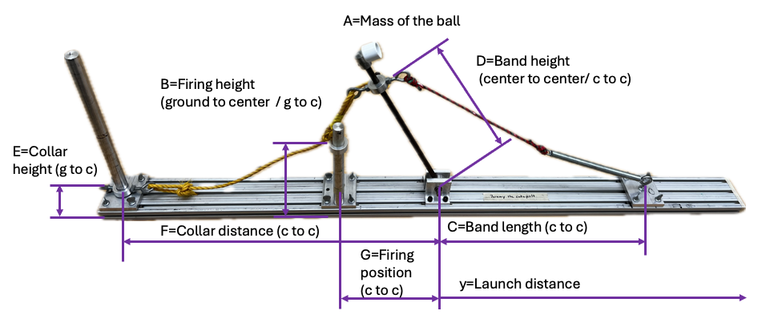
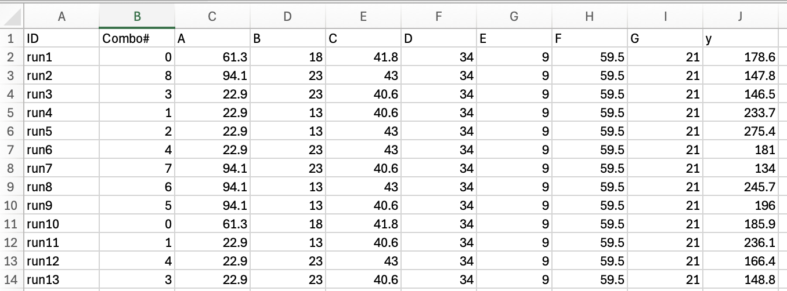
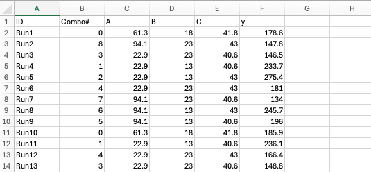

# Setup description
The figure below shows the physical catapult in the lab.  There are seven inputs (A,B,C,D,E,F,G) and one output(y). 

### Data structure in .csv files.
The file Catapult_ABCDEFGy_raw.csv contains the 'collective memory' of all the experimental data collected so far. 
A screenshot of the file Catapult_ABCDEFGy_raw.csv opened in Excel is shown below.

The first row of data file (Catapult_ABCDEFGy_raw.csv) is a header. The first two columns, ID and Combo#, are internal identifiers.
The rest of the file contains data collected from experiments. The length unit is centimeter and the mass unit is gram.

The file DOE_23FF_Group1.csv shows sample data from a 2-level, 3-factor, full factorial design of experiments. 
A screenshot of the file DOE_23FF_Group1.csv opened in Excel is shown below.

The file has similar structure as Catapult_ABCDEFGy_raw.csv but simplified.  The fixed inputs are not in the file. 
The data contains only the input variables (A, B,and C, called factors) and the output (y, called response).   
